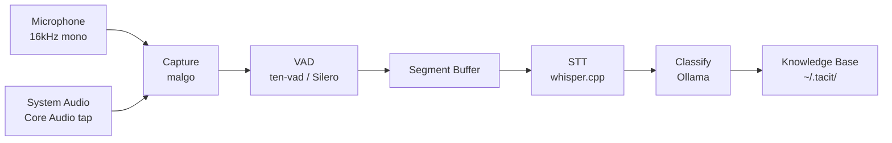

# tacit

> Harness your tacit knowledge into AI agent context — on-device, always-on transcription.

[](https://github.com/sangmin7648/tacit/releases)
[](https://go.dev/)
[](LICENSE)
[](https://github.com/sangmin7648/tacit/releases/latest)

```bash
curl -fsSL https://raw.githubusercontent.com/sangmin7648/tacit/main/install.sh | sh
tacit setup
tacit listen   # start capturing
```

---

Spoken ideas disappear. tacit transcribes them on-device, classifies them with Ollama, and surfaces them as live context in any AI conversation — automatically.

<!-- TODO: Add demo GIF showing tacit listen → speech → /tacit.knowledge retrieval -->

---

## How it works

```
speak → capture → VAD → STT → classify → store → retrieve
```

1. **Capture** — Records microphone and system audio simultaneously in real time
2. **Process** — Voice Activity Detection filters silence; Whisper transcribes speech on-device
3. **Classify** — Ollama extracts title, category, keywords, and summary from the transcript
4. **Store** — Saves a structured Markdown entry to `~/.tacit/<category>/`
5. **Retrieve** — `/tacit.knowledge` searches your knowledge base from inside any Claude conversation

---

## Features

- **Fully automatic** — speak naturally; tacit handles transcription, classification, and storage without any manual steps
- **On-device STT** — powered by [whisper.cpp](https://github.com/ggerganov/whisper.cpp); no audio ever leaves your machine
- **Dual audio sources** — captures microphone and system audio simultaneously
- **Language-agnostic** — Whisper auto-detects language; works with Korean, English, or mixed conversation
- **AI-native retrieval** — first-class [Claude Code CLI](https://docs.anthropic.com/en/docs/claude-code) skill integration for in-conversation search

---

## Use with AI

After `tacit setup`, two skills are available inside Claude Code conversations:

### `/tacit.knowledge` — search your spoken history

```
/tacit.knowledge summarize the search ranking discussion from earlier
/tacit.knowledge find the API design we talked about last week
/tacit.knowledge any ideas about the onboarding flow from last month?
```

### `/tacit.memorize` — save the current conversation

```
/tacit.memorize
/tacit.memorize skill development   # optional hint guides categorization
```

Analyzes the current Claude conversation thread and saves it as a structured knowledge entry — automatically available to future `/tacit.knowledge` queries.

---

## Configuration

Run `tacit setup` to generate two files in `~/.tacit/`:

- **`config.yaml`** — a generated reference listing every field and its current default. Regenerated by `tacit setup`; do not edit it.
- **`config-override.yaml`** — where your own settings go. Only the fields you uncomment here override the defaults.

`tacit config view` prints the merged result, tagging each field `[default]` or `[override]`. `tacit config edit` opens the override file.

### Transcription

| Field | Type | Default | Description |
|---|---|---|---|
| `whisper_model` | string | `large-v3-turbo` | Whisper model name, resolved as `ggml-<name>.bin` against the [whisper.cpp model repo](https://huggingface.co/ggerganov/whisper.cpp) and downloaded on first use — e.g. `base`, `small`, `medium`, `large-v3`, `large-v3-turbo`. Larger = more accurate, slower. |
| `language` | string | `auto` | Transcription language code (`auto`, `en`, `ko`, …). Pinning it to the language you actually speak markedly reduces wrong-language transcriptions. |
| `initial_prompt` | string | `""` | Vocabulary hint biasing decoding — useful for names, jargon, and acronyms Whisper keeps getting wrong. |
| `experimental` | bool | `false` | Enables non-speech token suppression during decoding plus ~192ms of VAD pre-roll padding, so a late-firing VAD onset doesn't clip the first word. |
| `transcript_denylist` | list | `[]` | Extra phrases to strip from transcripts, added to a built-in list of stock sentences Whisper hallucinates over silence (video outros and the like). A sentence is dropped only when a listed phrase makes up most of it; matching ignores case, spacing and punctuation. |
| `dedup_window` | duration | `3h` | Drops a transcript whose text has already been stored several times within this rolling window — the fingerprint of a stock hallucination, which recurs verbatim far more than real speech does. The first two occurrences per window are always kept, so a genuinely repeated remark survives. `0` disables. |
| `min_char_rate` | float | `0.2` | Drops a live transcript carrying too few characters for the length of audio it came from (letters and digits per second) — what is left when Whisper transcribes a stock phrase over a stretch it otherwise read as silence. Set low, so only unambiguous cases are caught. `0` disables. |

### Segmentation

| Field | Type | Default | Description |
|---|---|---|---|
| `min_speech_duration` | duration | `5s` | Minimum segment length to process. Shorter segments are discarded. |
| `silence_duration` | duration | `3s` | Silence required to end a speech segment. |
| `max_segment_duration` | duration | `30s` | Caps a single segment sent to Whisper. Longer speech is split and transcribed as it goes, keeping memory bounded. `0` disables the cap. |
| `max_session_duration` | duration | `5m` | Caps how long transcribed text accumulates before it is classified. Continuous speech never triggers the silence-based flush, so this keeps a long meeting from becoming one giant entry. With `max_segment_duration` at `0` this doubles as the split boundary, since text only accumulates at a split. `0` disables the cap. |
| `speech_threshold` | float | `0.5` | VAD confidence threshold (0–1). Higher = more conservative. |
| `energy_threshold` | int | `200` | Audio energy gate. Frames below this value are rejected before VAD. |

The three segmentation durations can be set per source, since a microphone and a meeting on your speakers behave differently. A source-specific value wins over the shared one; leave it at `0` to inherit.

| Suffix | `mic_` default | `speaker_` default |
|---|---|---|
| `min_speech_duration` | `2s` | `5s` |
| `silence_duration` | `10s` | `3s` |
| `max_segment_duration` | `30s` | `30s` |

### Capture and classification

| Field | Type | Default | Description |
|---|---|---|---|
| `capture_mic` | bool | `true` | Capture the microphone. |
| `capture_speaker` | bool | `true` | Capture system audio via ScreenCaptureKit. Requires Screen Recording permission. |
| `llm_provider` | string | `ollama` | Classification backend: `ollama` or `claude`. |
| `llm_model` | string | `qwen3.5` | Model used for classification. For `claude`, a Claude Code CLI model name such as `haiku`. |
| `skill_agent` | string | `claude` | Agent the `/tacit.*` skills are installed for. |

A transcript that reaches classification is always stored. If the classifier errors out, returns nothing usable, or fills in only some of the fields, the entry is repaired — a missing title is taken from its opening words, a missing category becomes `unsorted` — rather than being dropped, so nothing you actually said goes missing from `tacit list`.

The one exception is a deliberate skip: the classifier still discards a transcript it judges to carry nothing worth keeping (filler sounds, bare acknowledgements, call-connection chatter), and logs the text it dropped.

---

## Architecture



**Storage format** — each entry is a plain Markdown file:

```markdown
---
title: "Search ranking discussion"
category: "dev"
created_at: "2026-04-14T15:30:45+09:00"
keywords: ["search", "ranking", "BM25", "lexical", "recall"]
---

One-sentence AI-generated summary.

---

Raw transcribed text from speech.
```

Entries are stored under `~/.tacit/<category>/YYYYMMDD-HHMMSS.md` — plain files, no proprietary database, fully editable.

---

## Requirements

- macOS 14.2+ (Apple Silicon)
- [Claude Code CLI](https://docs.anthropic.com/en/docs/claude-code)

---

<details>
<summary>Build from source</summary>

**Requirements:** Go 1.23+, CMake, macOS

```bash
git clone --recursive https://github.com/sangmin7648/tacit.git
cd tacit
make build
make install   # installs to ~/.local/bin/tacit
```

> If `~/.local/bin` is not in your `PATH`:
> ```bash
> export PATH="$HOME/.local/bin:$PATH"
> ```

Run the end-to-end test to verify the full pipeline:

```bash
make e2e-test
```

</details>

<details>
<summary>Contributing</summary>

Issues and pull requests are welcome. Please open an issue first for significant changes.

```bash
make test       # run unit tests
make e2e-test   # build + process test audio through full pipeline
```

> **Note:** Do not run `go build ./...` directly — `pkg/stt` uses CGo against whisper.cpp and requires `make build` to compile first.

</details>
